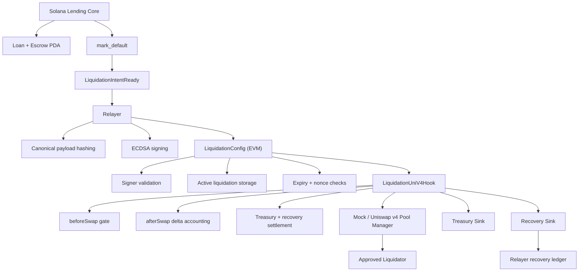

# Architecture Diagram

## Reading order

1. Solana originates and defaults the loan.
2. Relayer signs a canonical liquidation intent.
3. `LiquidationConfig` accepts only fresh, authorized intents.
4. `LiquidationUniV4Hook` enforces who can liquidate, how much can be sold, and how proceeds are split.
5. Treasury and recovery outputs are recorded for demo and judging.
