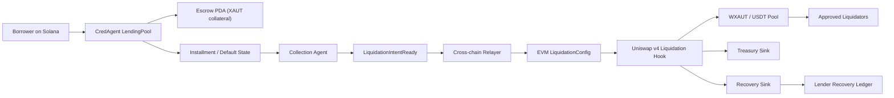

# MVP Architecture

## Goal

This workspace isolates the smallest cross-chain liquidation MVP that CredAgent can ship without moving the lending core off Solana.

The system is split into three apps:

- `apps/solana-program`
- `apps/relayer`
- `apps/evm-liquidation`

## Architecture diagram



## Happy path

1. Borrower takes a USDT loan on Solana and posts XAUT collateral.
2. CredAgent stores the loan in `LendingPool`.
3. XAUT remains locked in an escrow PDA.
4. Borrower misses repayment and exceeds the grace period.
5. Collection Agent marks the loan as defaulted on Solana.
6. Solana emits `LiquidationIntentReady`.
7. Relayer reads the event and builds a signed EVM liquidation payload.
8. EVM `LiquidationConfig` stores the active liquidation.
9. Uniswap v4 hook activates liquidation mode for the `WXAUT/USDT` pool.
10. Approved liquidator executes a hook-gated swap in `WXAUT/USDT`.
11. Hook derives proceeds from callback deltas and routes treasury and recovery amounts on EVM.
12. Relayer records execution for lender recovery accounting.

## Demo pair

- Solana collateral: `XAUT`
- Solana debt asset: `USDT`
- EVM liquidation collateral: `WXAUT`
- EVM recovery asset: `USDT`
- Demo pool: `WXAUT/USDT`

## App boundaries

### `apps/solana-program`

Owns:

- loan state
- escrow PDA state
- default marking
- liquidation-intent emission

### `apps/relayer`

Owns:

- Solana event consumption
- payload validation
- signer flow
- EVM config submission
- recovery recording

### `apps/evm-liquidation`

Owns:

- config contract
- callback-driven v4 hook
- liquidation execution controls
- treasury and recovery settlement

## Canonical event shape

```text
loan_id
pool
borrower
collateral_mint
collateral_amount
debt_outstanding
minimum_recovery_target
liquidation_mode
liquidation_urgency
intent_expiry
nonce
target_chain_id
source_program
```

## Canonical EVM payload

```text
loan_id
pool
borrower_id
collateral_mint
collateral_token
amount_to_liquidate
debt_outstanding
minimum_recovery_target
liquidation_mode
liquidation_urgency
approved_liquidator
treasury_sink
recovery_sink
fee_override_bps
treasury_fee_split_bps
max_liquidation_size
expiry
nonce
target_chain_id
source_program
```

## MVP scope

- one collateral asset
- one relayer
- one active liquidation per `(target_chain_id, pool, loan_id)` scope
- no bridge-back
- no auctions
- no multi-asset support

## Local demo status

Implemented:

- Day 9 happy-path demo in `apps/relayer/src/day9-local-demo.ts`
- Day 10 hardening demo in `apps/relayer/src/day10-hardening-demo.ts`
- callback-based `LiquidationUniV4Hook` using swap deltas instead of caller-supplied proceeds
- treasury sink plus recovery sink settlement on the EVM side

Still mocked for MVP:

- Solana event ingestion uses a static local event fixture in demo mode
- pool-manager integration uses a local mock instead of the full production Uniswap v4 package
- bridge-back to Solana is recorded in ledger terms, not executed
