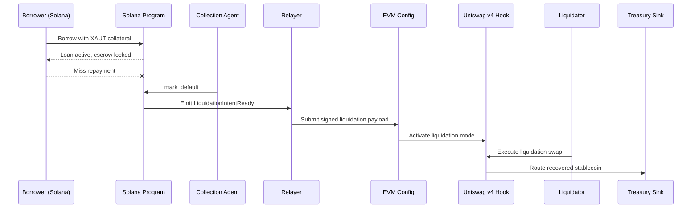

# Sequence

```mermaid
sequenceDiagram
    participant B as Borrower (Solana)
    participant S as Solana Program
    participant C as Collection Agent
    participant R as Relayer
    participant E as EVM Config
    participant H as Uniswap v4 Hook
    participant L as Liquidator
    participant T as Treasury Sink

    B->>S: Borrow with XAUT collateral
    S-->>B: Loan active, escrow locked
    B--xS: Miss repayment
    C->>S: mark_default
    S->>R: Emit LiquidationIntentReady
    R->>E: Submit signed liquidation payload
    E->>H: Activate liquidation mode
    L->>H: Execute liquidation swap
    H->>T: Route recovered stablecoin
```

## Notes

- Solana remains the loan source of truth
- relayer is the bridge between default state and EVM execution
- hook execution is constrained by the EVM config contract
