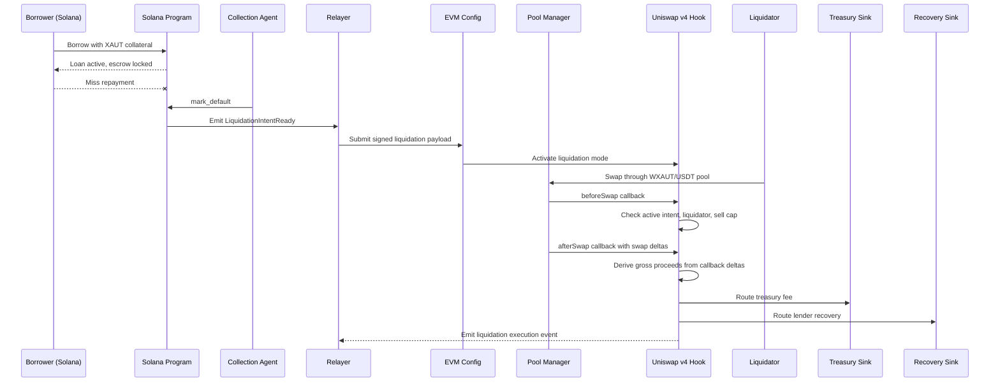

# Sequence

## Notes

- Solana remains the loan source of truth
- the relayer bridges default state into EVM execution
- `LiquidationConfig` controls freshness, signer validation, and liquidation scope
- local demo mode uses a mock pool manager to exercise the callback settlement path
